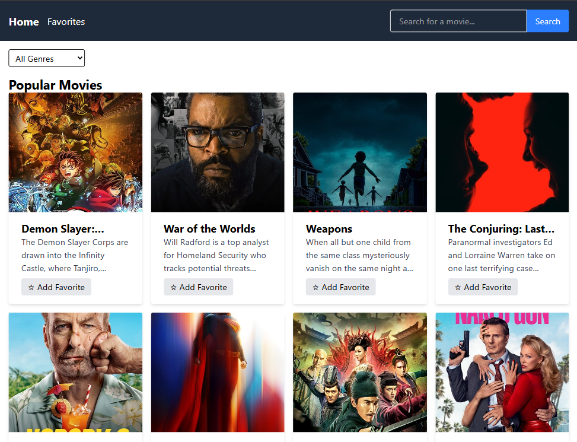

# Movie App 🎬 (React + Vite + Tailwind + TMDB API)

[](https://cinema-browser.netlify.app/)  
  


A responsive **Movie Browser** built with **React + Vite + Tailwind** using **TMDB API**.

> Practice project to strengthen React skills:
>
> - Routing & component architecture
> - API integration & state management
> - Favorites with localStorage
> - Responsive design & deploy

---

## 📌 About

This project has reached **v1.0.0 stable release**.  
It allows users to browse, search, filter, and view movie details from TMDB.  
Favorites feature is stored in localStorage. Deployed on Netlify.

---

## ✨ Features

- Browse popular movies.
- Search movies by keyword.
- Filter movies by genre.
- Movie detail page (poster, title, overview, rating, release date).
- Add/remove favorites (persisted in localStorage).
- Responsive UI (mobile → desktop).

---

## 🖼️ Screenshot



---

## 🛠 Tech Stack

- **Frontend**: React 19 + Vite + TailwindCSS
- **API**: TMDB (The Movie Database)
- **State**: React Context API + Hooks
- **Deploy**: Netlify

---

## 📂 Project Structure

```
src/
 ┣ assets/            # static assets (images, icons, fonts)
 ┣ components/        # reusable UI components
 ┃ ┣ Footer.jsx
 ┃ ┣ GenreFilter.jsx
 ┃ ┣ MovieCard.jsx
 ┃ ┣ MovieList.jsx
 ┃ ┣ Navbar.jsx
 ┃ ┣ Pagination.jsx
 ┃ ┗ SearchBar.jsx
 ┣ context/           # React Context (global state)
 ┃ ┗ FavoritesContext.jsx
 ┣ hooks/             # custom React hooks (currently empty, ready for extension)
 ┣ layouts/           # shared layouts
 ┃ ┗ MainLayout.jsx
 ┣ pages/             # main app pages
 ┃ ┣ Home.jsx
 ┃ ┣ MovieDetail.jsx
 ┃ ┣ Favorites.jsx
 ┃ ┗ SearchResult.jsx
 ┣ services/          # API services and configs
 ┃ ┗ tmdb.js
 ┣ utils/             # utility/helper functions (currently empty, optional)
 ┣ App.jsx            # root component
 ┗ main.jsx           # React entry point
```

---

## 🚀 Getting Started

```bash
# Clone repo
git clone https://github.com/movie-app/movie-app.git
cd movie-app

# Install deps
npm install

# Start dev server
npm run dev
# → http://localhost:5173

# Build for production
npm run build
```

---

## 📅 Roadmap

### ✅ Completed

- M1: Setup Vite + Tailwind + TMDB API
- M2: Layout & Router (React Router v7)
- M3: Movie list + pagination
- M4: Movie detail page
- M5: Search + filter
- M6: Favorites feature (localStorage + context)
- M7: Responsive design (mobile-first)
- M8: Clean up & deploy
- M9: UI/UX enhancements + QA
- M10: Portfolio prep + release v1.0.0

### 🔜 Planned

- v1.1.0: Improve UI with skeleton loaders
- v1.2.0: Add theme switcher (dark/light)
- v1.3.0: Add cast & trailer in Movie Detail

---

## 📝 Working Rules

- **Architecture**: component/page/service separation.
- **Code style**: clean imports, reusable utils/hooks.
- **Workflow**: setup → code → debug → deploy.
- **Commit**: follow convention (`feat`, `fix`, `refactor`, `docs`, `style`, `chore`).
- **Debug**: read logs, isolate bug, understand before using AI.
- **Docs**: README clear, with setup & demo link.
- **Repo**: clean (gitignore, no junk files).

---

## 📜 License

MIT — see [LICENSE](./LICENSE).
